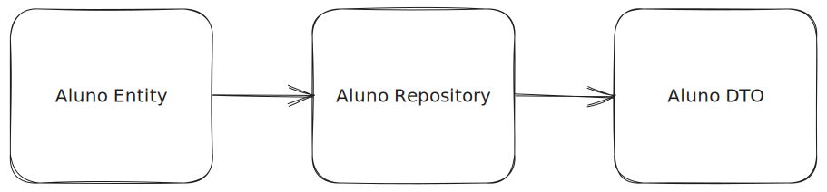

# Spring-boot api + java + maven

- Run

```sh
mvn spring-boot:run
```

- GET    /alunos

- POST   /alunos

```json
// body
{
  "name":"Nome do Aluno"
}
```

- PUT    /alunos/{id}

```json
// body
{
  "name":"Nome do Aluno Alterado"
}
```

- DELETE /alunos/{id}

## DTO


